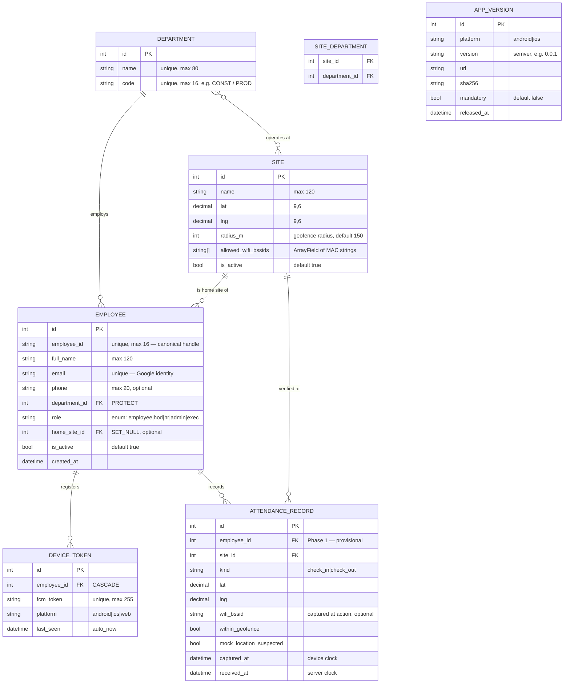

# Entity-Relationship Diagram (ERD) — Data Model

**Status:** ✅ Live · **Owner:** Backend · **Source of truth for:** database schema, `inspired-api` Django models
**Last updated:** 2026-06-18 · **Scope shown:** Sprint 0 (committed) + Phase 1 attendance (preview)

---

## 0. What an ERD is and why it comes first

An **Entity-Relationship Diagram** describes the *things the system remembers*
(entities), the *facts about each thing* (attributes), and *how things relate*
to each other (relationships, with cardinality). It is the blueprint the
database is built from.

**Why it is one of the first documents written:**

1. **It is a contract three teams depend on.** The Django models, the dashboard
   tables, and the Flutter offline cache all encode the same entities. If they
   disagree on whether an `Employee` has one role or many, integration breaks.
   The ERD settles that *once*, before anyone writes a migration.
2. **Schema changes are the most expensive to make late.** Renaming a column
   after production data exists means a migration, a backfill, and coordinated
   client releases. Cheap on a diagram, costly in code.
3. **It forces the domain questions early.** Drawing the ERD makes you answer:
   "Can an employee belong to two departments?" "Is a site's WiFi list one value
   or many?" Those answers are business decisions, not coding details.

**How an ERD is built (the method):**

1. List the **nouns** in the spec — Employee, Department, Site, Device… those are
   candidate entities.
2. For each, list its **attributes** and pick the **primary key** (the stable
   unique handle).
3. Draw **relationships** between entities and label the **cardinality**
   (one-to-one, one-to-many, many-to-many).
4. **Normalize**: remove duplicated facts; a fact should be stored once.
5. Mark what is **in scope now** vs **later**, so the model is honest about phase.

We use [Mermaid](https://mermaid.js.org/syntax/entityRelationshipDiagram.html)
`erDiagram` so the diagram lives in version control as text and renders in
GitHub, VS Code, and most viewers.

### Crow's-foot notation cheat-sheet (how to read the diagram)

| Symbol on the line | Meaning |
|---|---|
| `||` | exactly one |
| `o|` | zero or one |
| `}o` | zero or many |
| `}|` | one or many |

So `DEPARTMENT ||--o{ EMPLOYEE` reads: *one department has zero-or-many
employees; each employee belongs to exactly one department.*

---

## 1. Scope boundary

This data model is drawn in two layers so it stays honest about where the
project is:

- **Committed (Sprint 0):** `Department`, `Site`, `Employee`, `DeviceToken`,
  plus the `SiteDepartment` join. These are being implemented now.
- **Phase 1 preview:** `AttendanceRecord` and `AppVersion`. SPRINT_0 references
  both (attendance app stubs; `GET /app/versions/latest`), so they are shown to
  validate the foreign keys — but their detailed attributes are provisional
  until Phase 1 design.
- **Later phases (NOT modeled yet):** Leave, Item Requests, Project Tracking,
  Audit Log. Listed in §6 as a roadmap so we know the model will grow; we do
  **not** invent their columns now.

---

## 2. The diagram

> Note: `SITE ||--o{ ATTENDANCE_RECORD` and `EMPLOYEE ||--o{ ATTENDANCE_RECORD`
> together model that every attendance record names one employee and one site.
> `APP_VERSION` is intentionally **standalone** — it has no foreign keys; it is a
> system catalog the update mechanism reads, not part of the people graph.

---

## 3. Entities & key decisions (the rationale)

### Department
The organizational unit. `code` exists alongside `name` because JWT claims and
URLs want a short stable token (`CONST`) rather than a display string that HR
might re-spell. **One employee → one department** (`on_delete=PROTECT`: you
cannot delete a department that still has employees — it would orphan them).

### Site
A physical location with a **geofence** (`lat`/`lng`/`radius_m`) and an
**allow-list of WiFi BSSIDs**. Two non-obvious modeling decisions:

- `allowed_wifi_bssids` is an `ArrayField`, not a child table. A BSSID list is a
  small, always-read-together value with no identity of its own — promoting it
  to its own table would add a join for zero benefit. (If BSSIDs ever needed
  their own attributes — label, last-verified date — we'd normalize it out.)
- **Site ↔ Department is many-to-many** (`SITE_DEPARTMENT` join table): a site
  hosts several departments, and a department may operate across sites. This is
  the one M2M in the committed model.

### Employee
The center of the graph. Design decisions worth stating:

- **`role` is a string enum on the row, not a separate `Role` table.** There are
  exactly five fixed roles (`employee/hod/hr/admin/exec`) that change only when
  we ship code. A lookup table would buy flexibility we don't want (HR inventing
  roles the code can't enforce). The authorization rules live in the
  [RBAC matrix](./rbac-matrix.md), not the database. *If* roles ever became
  data-driven, this is where we'd normalize.
- **`email` is the Google identity** and is `unique`. Login proves identity via
  Google; the *existence of this row* is what proves authorization (SPRINT_0 §6).
- **`home_site` is `SET_NULL`, optional** — losing a site shouldn't delete people.

### DeviceToken
FCM push tokens, **CASCADE** on employee (delete the person → their tokens go).
Privacy constraint from SPRINT_0 §12a: this table exists *only* to deliver push
notifications. **No admin UI may surface it** — no "last seen" dashboards. That
constraint is documented here so a future developer doesn't "helpfully" build a
devices page.

### AttendanceRecord (Phase 1 preview)
Modeled now to prove FKs resolve. Two timestamps on purpose: `captured_at`
(device clock, possibly offline/skewed) vs `received_at` (server clock, when the
offline queue synced). `mock_location_suspected` reflects the anti-spoofing
posture (SPRINT_0 §13) — a flag for the HR review queue, never an auto-reject.

### AppVersion (Phase 1 preview)
Backs `GET /app/versions/latest`. Standalone catalog; no relationships.

---

## 4. Referential integrity summary

| Relationship | Cardinality | On delete | Why |
|---|---|---|---|
| Department → Employee | 1 : many | PROTECT | Don't orphan employees |
| Site ↔ Department | many : many | (join) | Sites host many depts; depts span sites |
| Site → Employee (home) | 1 : many | SET_NULL | Site removal shouldn't delete people |
| Employee → DeviceToken | 1 : many | CASCADE | Tokens are meaningless without the person |
| Employee → AttendanceRecord | 1 : many | PROTECT *(planned)* | Attendance is a legal/HR record — preserve |
| Site → AttendanceRecord | 1 : many | PROTECT *(planned)* | Preserve the verified location |

---

## 5. Normalization notes

- **3NF for the people graph.** No transitive dependencies; e.g. an employee's
  department is a FK, not a duplicated department name.
- **Deliberate denormalization:** `allowed_wifi_bssids` (array) and the dual
  timestamps on `AttendanceRecord`. Each is justified above — denormalize on
  purpose, with a reason, never by accident.

---

## 6. Roadmap — entities NOT yet modeled

Listed so the model's growth is anticipated, not invented prematurely:

| Future entity | Phase | Will relate to |
|---|---|---|
| `LeaveRequest` | Leave module | Employee, approver (Employee) |
| `ItemRequest` / `StoreItem` | Phase 3 | Employee, Department, Site |
| `Project` / `ProjectTask` | Phase 4 | Department, Site, Employee |
| `AuditEvent` | Cross-cutting | Employee (actor) — security events only (§12a.6) |

When a phase begins, add its entities to §2 and promote them out of this list.

---

## 7. Change log

| Date | Change |
|---|---|
| 2026-06-18 | Initial ERD — Sprint 0 committed entities + Phase 1 preview |
